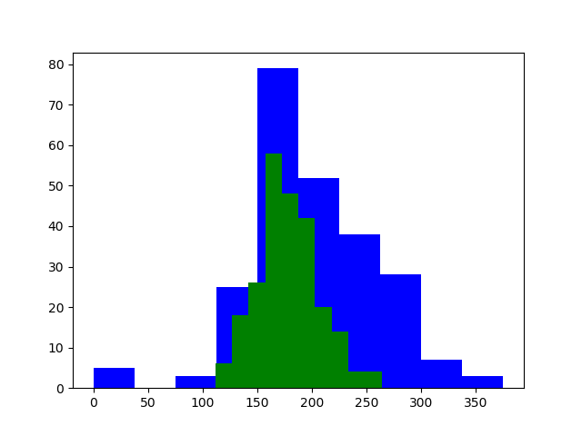
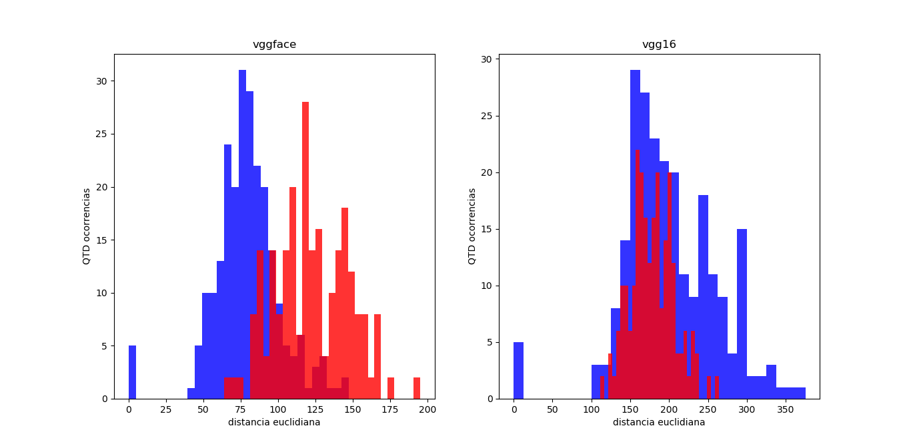

# visao-computacional
comparando desempenho de reconhecimento facial entre vggface, vggface2 e vgg16

My final Roc curve of distance cossin vs euclidean with vggface2: 

_____________________________________________________________________
My first test histogram with vggface and vgg16 using few images: 

histogram of diference vggface1 and vgg16 in recognition facial: 

Histogram vggface and <strike>vgg16</strike> vggface2: 

Roc curve comparation for vggface and vggface2 using euclidean distance: 

Histogram of comparation to distance cossin and euclidean using vggface2: 

